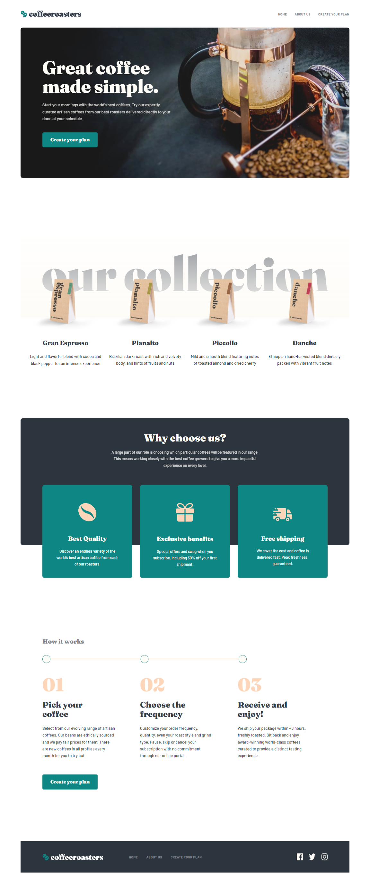

# Frontend Mentor - Coffeeroasters subscription site solution

This is a solution to the [Coffeeroasters subscription site challenge on Frontend Mentor](https://www.frontendmentor.io/challenges/coffeeroasters-subscription-site-5Fc26HVY6). Frontend Mentor challenges help you improve your coding skills by building realistic projects.

## Table of contents

- [Overview](#overview)
  - [The challenge](#the-challenge)
  - [Screenshot](#screenshot)
  - [Links](#links)
  - [Built with](#built-with)
- [Author](#author)

### Overview

### The challenge

Users should be able to:

- View the optimal layout for each page depending on their device's screen size
- See hover states for all interactive elements throughout the site
- Make selections to create a coffee subscription and see an order summary modal of their choices

### Screenshot

### Links

- Solution URL: [Add solution URL here](https://your-solution-url.com)
- Live Site URL: [https://mell789.github.io/coffeeroaster-subscription-site/](https://mell789.github.io/coffeeroaster-subscription-site/)

### Built with

- HTML
- CSS
- Flexbox
- Mobile-first workflow
- [Bootstrap](https://getbootstrap.com/) - Frontend toolkit
- [React](https://reactjs.org/) - JS library

## Author

- Github - [Mell789](https://github.com/Mell789)
- Frontend Mentor - [@Mell789](https://www.frontendmentor.io/profile/Mell789)
